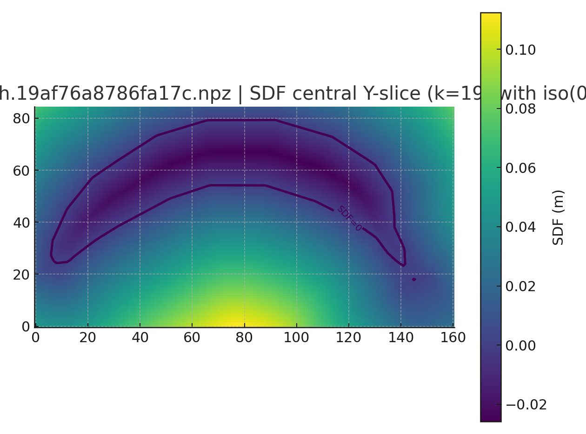
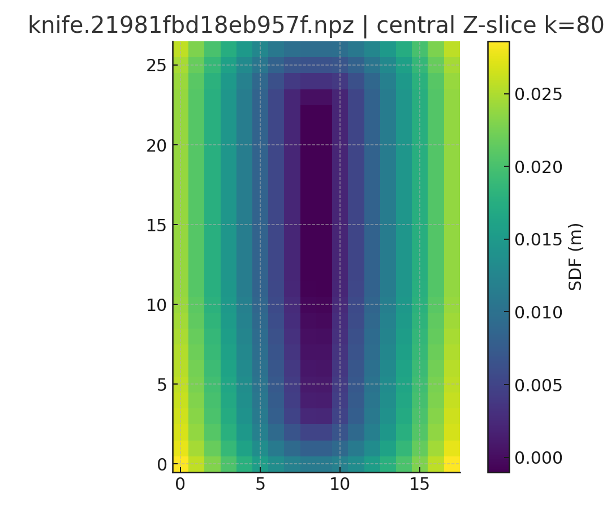
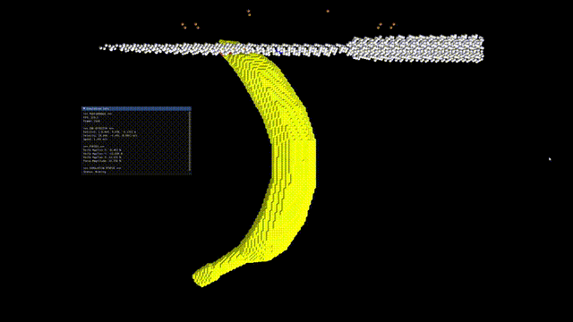

# MLS‑MPM Cutting Demo

High‑level structure:
- **`run.py`** — CLI entry point. Loads YAML, builds/loads SDF, launches the simulation.
- **`mesh_sdf.py`** — Mesh→SDF sampling (via `trimesh`) + optional knife blade mask.
- **`transforms.py`** — Small linear‑algebra utilities (Euler→matrix, frame adapters, SE(3) compose/invert). Memoized.
- **`colliders.py`** — SDF‑based colliders (Knife, Board) with contact classification and response.
- **`sim.py`** — MLS‑MPM physics core + cutting logic + multi‑cut scheduler + logging/export.
- **`renderer.py`** — Taichi UI viewer, particle/overlay rendering, and light‑weight debug proxies.
- **`output_manager.py`** — Fixed‑FPS exporter/logger orchestrator.

> Tested with Python 3.10+. GPU (CUDA/Vulkan) strongly recommended for non‑trivial grids.

---

## 1) Installation

```bash
# Core deps
pip install taichi trimesh numpy pyyaml

# Optional: if you will export PLY/NPZ and postprocess in Jupyter
pip install matplotlib ipykernel
```

Taichi will auto‑select the best backend (CUDA→Vulkan→CPU). You can override via env variables:
```bash
TI_ARCH=cuda python run.py --preview
```

---

## 2) Quick start

```bash
# Preview (spawn viewer, do NOT step physics)
python run.py --config configs/example_cutting.yaml --preview

# Run simulation headless (no viewer; faster)
python run.py --config configs/example_cutting.yaml --run-sim --headless

# Run sim with viewer
python run.py --config configs/example_cutting.yaml --run-sim
```

If the `--config` path does not exist, `run.py` falls back to `./example_cutting.yaml` in the working directory.

---

## 3) SDF caching

`run.py` stores SDF packs as compressed NPZ in `cache_sdf/` by default.
The cache key includes mesh path, size/mtime, voxel resolution, and the knife blade metadata.
- Disable cache: `--no-sdf-cache`
- Force rebuild: `--rebuild-sdf`
- Custom cache folder: `--sdf-cache-dir <dir>`

<p align="center">
  
  
</p>

Each NPZ contains:
```
sdf [Nz,Ny,Nx]     origin[3]     voxel_size
T_asset_to_world   grid_shape    (optional) blade_mask, blade_axis, blade_fraction
```
If a cache is missing critical keys, an informative error suggests rebuilding.

---

## 4) Viewer & overlays

- Camera presets: `--viewer-camera top|front|auto|manual` (manual uses the YAML pose).
- Lock/unlock camera during simulation: `--lock-camera | --unlock-camera`.
- Optional proxies: `--show-board` shows a sparse board surface; `--show-grid` shows a sparse grid.
- Damage visualization: `--damage-viz | --no-damage-viz` or configure `damage.damage_visualization` in YAML.

Performance note: the grid debug view now uses a cached, sub‑sampled point cloud to avoid per‑frame recomputation.


---

## 5) MLS-MPM/CPIC Cutting Demo video




---

## 6) Output: logging & export (unified FPS)

Enable a unified output cadence by setting `output.enabled: true` in the YAML (default).
- **Export (particles)** — `output.export: {enabled: true, out_dir: "exports", format: "npz|ply"}`
- **Logging (EE/forces)** — `output.logging: {enabled: true, out_dir: "logs", chunk_size: 10000, mode: "timestep|fps"}`
- **FPS** — `output.fps: 24` controls both exporter and logger cadence.

Generated files:
- `exports/frame_000000.npz|ply` with positions (and optional colors).
- `logs/log_0000_000000-000239.json` with EE pose, knife animation, and forces (SI + normalized).

---

## 7) YAML knobs (recommended baselines)

Below is a minimal set with practical defaults. Tune in **meters (m)** and **seconds (s)**.

```yaml
world:
  grid_resolution: 120       # 128+ for high fidelity >> For collision accuracy, use 120+ 
  dt: 2.0e-4                 # Reduced dynamically for CFL if too large
  bounds_min: [-0.25, 0.00, -0.25]
  bounds_max: [ 0.25, 0.50,  0.25]
  gravity: [0.0, -9.81, 0.0]
  reso_exponent: 0.5         # Resolution scaling of damage/tip bands

cutting_mesh:
  particle_spacing: 0.0033   # ~3.3 mm; reduce for denser particles
  density: 400               # kg/m^3
  elasticity:
    youngs_modulus: 3.0e5    # Pa (softer fruit ~1e5..5e5)
    poisson_ratio: 0.45
  grid_damping_ratio: 0.03
  particle_damping: 0.03
  restitution: 0.01          # knife↔mesh restitution

knife:
  motion:
    cutting_speed_mps: 0.6
    return_speed_mps: 0.6
    z_offset: 0.0
  friction: 0.30
  blade: {axis: Y, fraction: 0.5}

board:
  friction: 0.5
  restitution: 0.0
  floor_gap: 0.005

cutting:
  num_cuts: 5
  cut_order: center-out      # center-out | left-to-right | right-to-left
  z_margin_ratio: 0.05
  dwell_frames: 6
  tip_force_gain: 2.0
  tip_band: 0.015            # meters (auto‑scaled with resolution)
  no_stiffness_drop: true

plasticity:
  enabled: false
  model: j2
  yield_stress_kpa: 0.0      # enable for tougher materials
  hardening_kpa: 0.0
  viscoplastic_gamma: 0.0

damage:
  damage_visualization: true
  # Prefer dimensionless threshold via v_hat; the code converts to m/s using dx/dt
  damage_v_hat: 0.30
  # Optional: specify band in voxels for resolution‑stable behavior
  damage_band_vox: 1.5
```

**Rules of thumb**
- Increase `grid_resolution` or decrease `particle_spacing` for fidelity; reduce `dt` if dynamics explode (the code auto‑clips to a CFL‑safe value).
- Use `cut_order: center-out` for more stable multi‑cut sequences.
- Start with `restitution ≈ 0.01` for soft materials; raise for a snappier knife rebound.
- If particles cling to the knife on the up‑stroke, friction on the knife is reduced internally; you can also lower `knife.friction`.

---

## 8) Dev notes (code organization)

- Pure helpers are **memoized** (`functools.lru_cache`), e.g., Euler→matrix and plan ordering (“center‑out”).
- `renderer._render_grid_visualization()` now uses a cached subsample instead of generating a full grid every frame.
- Quadratic B‑spline weights were factored out into a single Taichi function for readability.
- Unused imports and duplicate code paths were removed.

---

## 9) CLI (full)

```text
--config PATH                 YAML config (fallback: ./example_cutting.yaml)
--preview                     Sim OFF, seeding/viewer only
--run-sim                     Sim ON
--headless                    Viewer OFF (simulation only)
--radius-scale FLOAT          Render radius scale
--no-sdf-cache                Disable SDF cache
--rebuild-sdf                 Force SDF rebuild
--sdf-cache-dir DIR           SDF cache folder

--viewer-camera {top,front,auto,manual}  Override viewer.camera_mode
--lock-camera                  Lock camera to initial pose
--unlock-camera                Do not lock camera even if YAML requests

--damage-viz | --no-damage-viz Override damage visualization
--output-fps FLOAT             Unified FPS for logging & export
--export-format npz|ply        Export format
--export-dir DIR               Export folder
--log-dir DIR                  Logging folder
--log-chunk INT                Logging chunk size
--show-board                   Show board proxy
--show-grid                    Show sparse grid proxy
```

---

## 10) Repro tips

- If SDF caches become incompatible, delete `cache_sdf/*.npz` **or** run with `--rebuild-sdf`.
- For numerical stability, the solver reduces `dt` to a CFL‑safe value at startup and clamps extreme `det(F)` during updates.
- GPU drivers matter; if you see Taichi errors with CUDA, try `TI_ARCH=vulkan` or `TI_ARCH=cpu` to compare behavior.

Happy slicing!